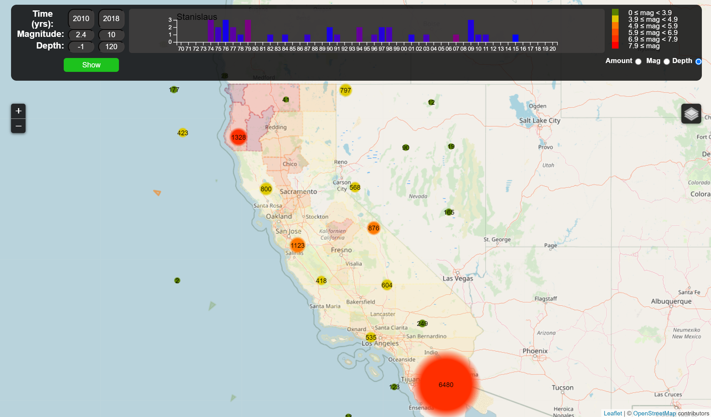
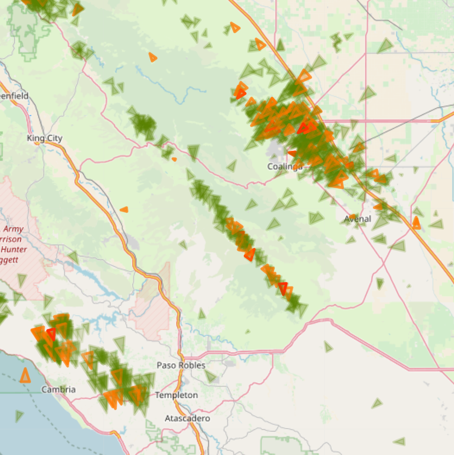

# Visualization Tool for Applying Unsupervised Learning Techniques on Seismic Data 

by Julius Rauscher and Adam Norris

Visual Analysis of Earthquake data in California from 1990 - 2018 using [Leaflet](https://leafletjs.com/).

Earthquake data was extracted from [United States Geological Survey](https://earthquake.usgs.gov/earthquakes/search/), county borders are taken from [California Open Data Portal](https://data.ca.gov/dataset/ca-geographic-boundaries).

The Application allows to filter the data by time, magnitude and depth. Results are clustered using [Leaflet Markercluster](https://github.com/Leaflet/Leaflet.markercluster).

Earthquakes are represented by triangles, with color encoding the magnitude of each quake. The rotation gives information about the timeframe, with similar angles indicating temporal closeness.

## Running

To start the visualization tool, simply run the following command:

 `docker-compose up`

The frontend can be accessed at localhost:4200
